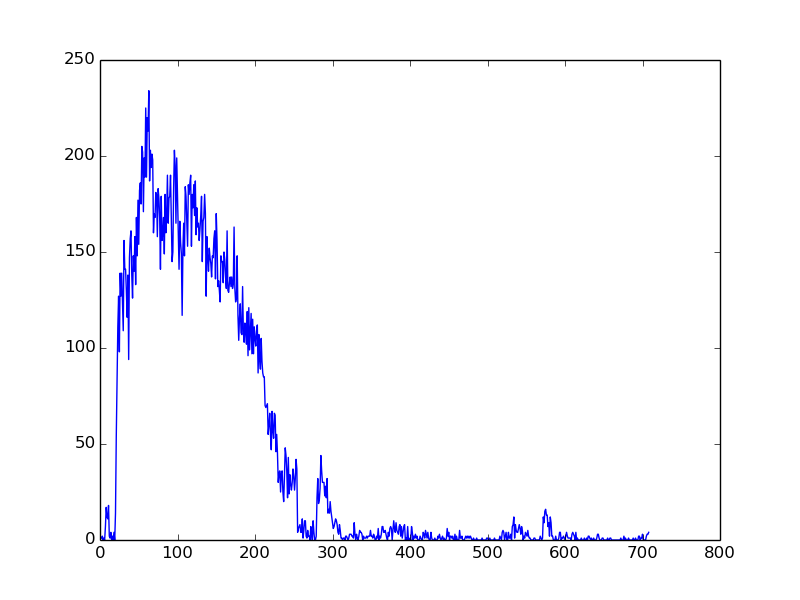
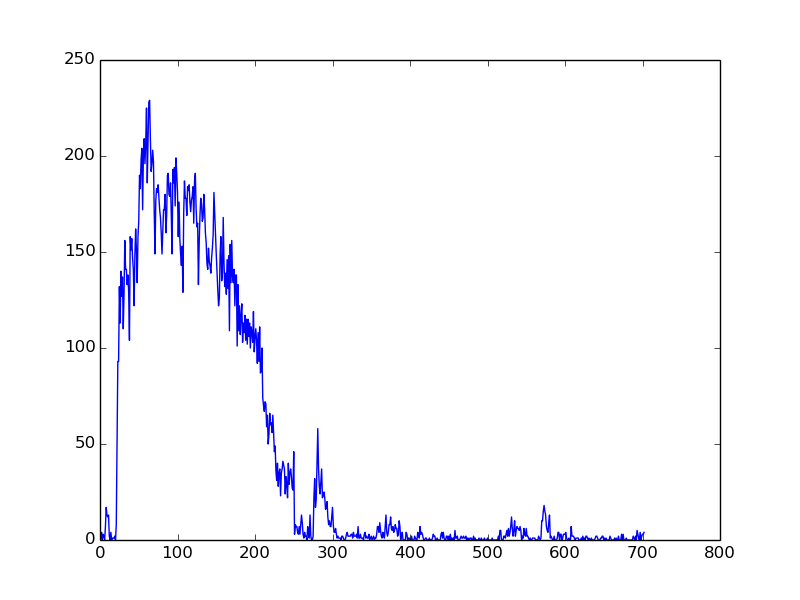
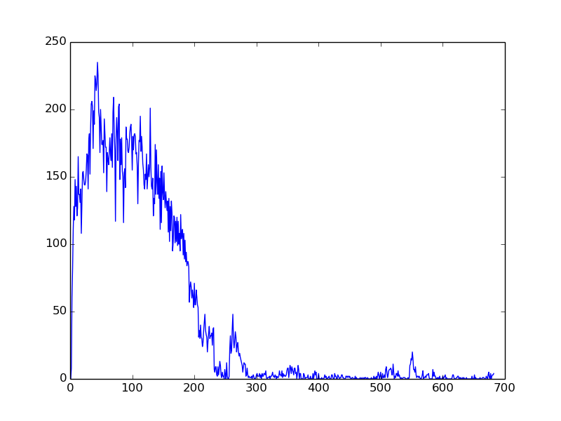
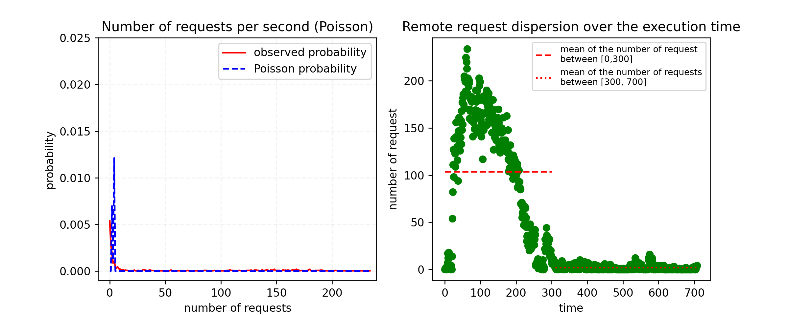
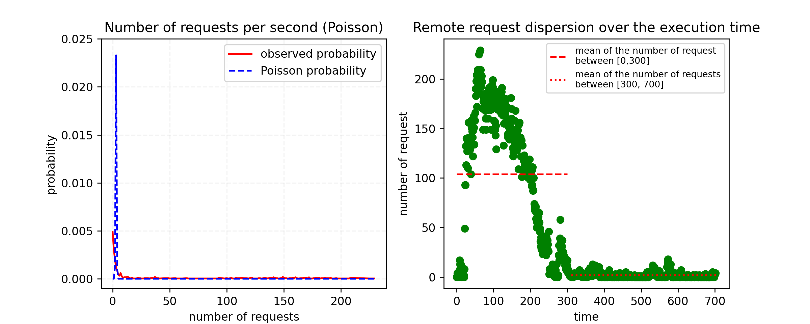
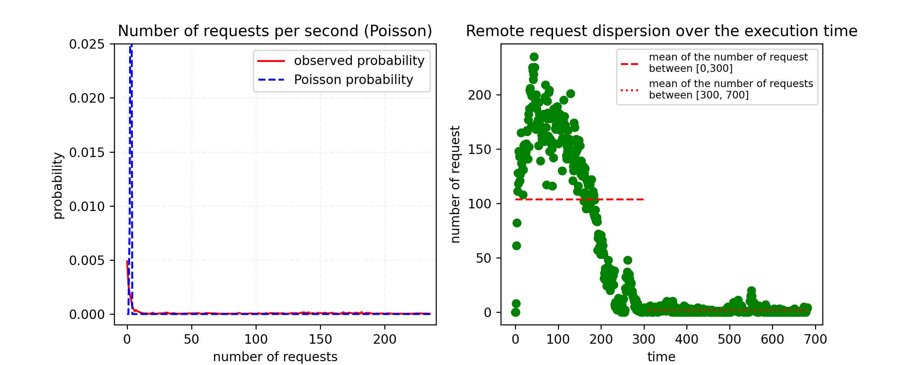
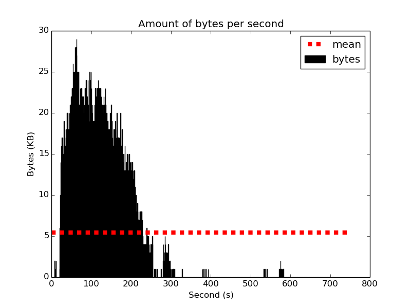
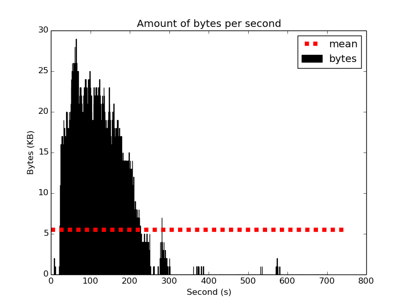
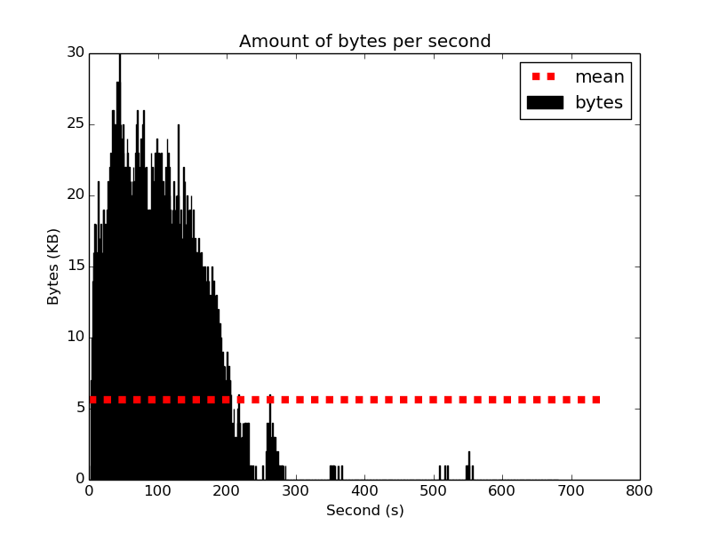

#time - request Number 

These three diagrams are the plots for showing the dispersion of the requests within the time. X-axis denotes the overall 
execution time of the simulation and y-axis denotes the number of requests. It shows that at the beginning of the simulation,
There is a sharpe increase in the number of requests, meaning that, each core requests its required data resided in a remote
memory. After passing around 5 minutes, the number of requests considerably falls down due to the fact that each core has its
required data to continue processing. 

# second time-slot - number of request 

These above diagrams are the plots for the outputs Remote#1,2,3. The right plots demonstrate the all remote request dispersion
over the execution time of the simulation just like the above-mentioned plots. The left ones shows the number of requests 
per second. I believe that the random variable of the arrival of the remote requests follows poisson distribution. Therefore,
I plotted both the observed statistics and also poisson distribution of the random variables that I captured. For further
investigation, I plotted the random variable of the amount of time it takes to have 1 request, and the results are as below:

On the left side plots, the x-axis shows the time-epochs for 1 request. It shows that the majority of the requests occur
in a very short time-epochs. It means that, in this benchmark and this configuration, we witness large number of small 
time-epochs with a single request. On that of right side, it shows that most of the period of time-epochs are less than 120
microsecond. 

